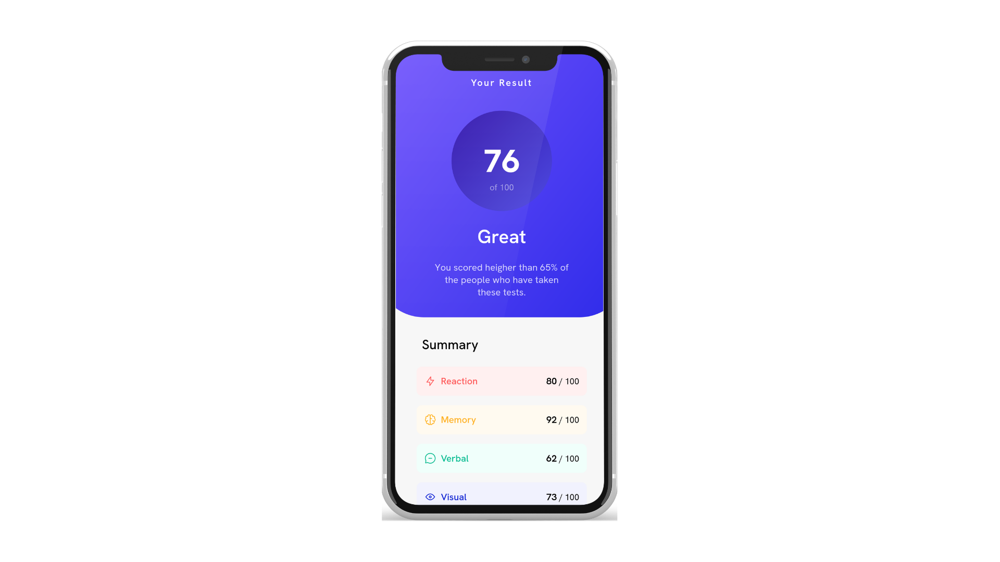
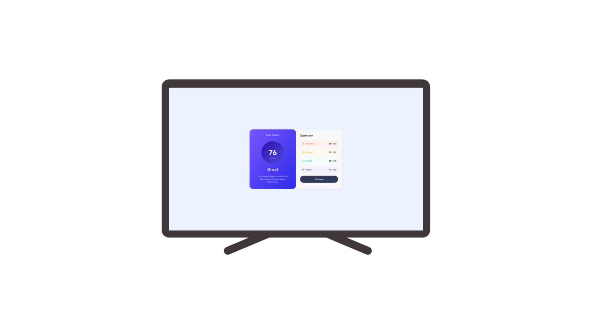

# Results Summary Component

A clean, fully responsive results summary component built with HTML and CSS.

## 📸 Project Preview

| Mobile View | Desktop View |
| :---: | :---: |
|  |  |

## 🚀 Features
* **Responsive Design:** Seamlessly adjusts from mobile to desktop layouts.
* **Modern UI:** Uses a clean color palette, gradients, and subtle shadows.
* **Interactive:** Hover states for summary items and buttons.
* **Clean Code:** Well-organized CSS structure.

## 🛠 Tech Stack
* HTML5
* CSS3 (Flexbox, Media Queries, Gradients)

---
*Created by Abdallah El-Saadany*